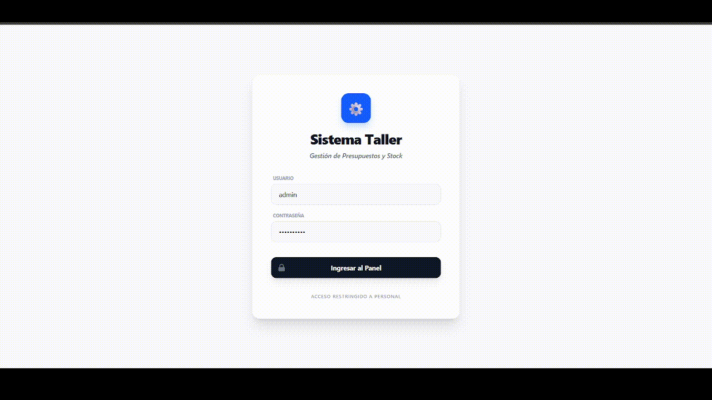

# ⚙️ **Sistema de Gestión para Taller de Bicicletas** 🚲
Este es un sistema de gestión integral desarrollado para la administración de un taller de reparación de bicicletas. Permite gestionar clientes, bicicletas, repuestos, servicios y la generación de presupuestos con control de stock automatizado.

---

# 🌐 Despliegue Demo

La aplicación ya se encuentra en producción! Podés probarla ingresando en la  siguiente URL:

* 💻 **Frontend:** [taller-bicicletas-three.vercel.app](https://taller-bicicletas-three.vercel.app/)
* 🔑 **Credenciales de Prueba:**
    * **Usuario:** `admin`
    * **Contraseña:** `taller2026`
* ⚠️ *Nota:* El backend utiliza el plan gratuito de Render. Si es la primera vez que ingresás en el día o tras un periodo de inactividad, el servidor puede tardar entre **1 y 2 minutos en "despertar"**.

---

# 🚀 Características Principales
- **Gestión de Clientes y Bicicletas**: Registro detallado de propietarios y sus bicicletas asociadas.

- **Control de Stock de Repuestos**: Validación de stock en tiempo real al agregar productos a un presupuesto.

- **Servicios**: Catálogo de mano de obra con gestión de "Baja Lógica" (Soft Delete) para mantener el historial contable.

- **Presupuestos Dinámicos**: Cálculo automático de totales finales (Servicios + Repuestos) y manejo de estados (PENDIENTE, FACTURADO, ANULADO).

- **Integridad de Datos**: Validaciones de negocio para evitar duplicados de DNI, Email, Teléfono y códigos de repuestos.

---

# 🛠️ Tecnologías Utilizadas
- **Backend**: Java 21, Spring Boot, Spring Data JPA, Spring Security (InMemory Auth)

- **Frontend**: JavaScript, Vite, Tailwind CSS v4

- **Base de Datos**: MySQL ( Desarrollo local / Producción en Aiven) / H2 (Testing)

- **Hosting / Deploy**: Vercel (Front) & Render (Back + Docker)

- **Testing**: JUnit 5, Mockito, AssertJ

- **Validaciones**: Bean Validation (Hibernate Validator)

---

# ✅ Calidad y Testing
El proyecto cuenta con una robusta suite de Tests Unitarios que aseguran la estabilidad de las reglas de negocio:

- **Pruebas de Servicio**: Se mockearon los repositorios para testear la lógica pura, asegurando que:

    + No se descuente stock si no hay disponibilidad.

    + No se borren registros con relaciones activas (ej. no borrar un cliente con bicicletas).

    + El stock se devuelva automáticamente al anular un presupuesto.

- **Pruebas de Controlador**: Uso de MockMvc para validar los endpoints REST y el manejo de excepciones personalizadas.

---
# 🚀 Pruebas con Postman o OpenAPI (Swagger)
+ **Postman:** He incluido una colección para facilitar las pruebas de los endpoints. Para usarla, importa el archivo `docs/TallerBicicletas.postman_collection.json` en tu Postman.

+ **Swagger:** También podés visualizar y probar la API directo en producción desde la interfaz de Swagger ingresando a: `https://taller-bicicletas-back.onrender.com/swagger-ui/index.html` (Puede demorar un par de minutos en conectarse con Render).

---

# 🛠️ Buenas Prácticas y Arquitectura
- **Arquitectura en Capas**: El proyecto está estructurado siguiendo el patrón de diseño por capas (Controller - Service - Repository), separando claramente las responsabilidades.

- **Código Limpio**: Nombramiento semántico de variables y métodos, código autodocumentado y métodos breves con una única responsabilidad.

- **Inyección de Dependencias**: Uso de @Autowired y constructores para facilitar el desacoplamiento y la testeabilidad.

- **Manejo Global de Excepciones**: Implementación de un GlobalExceptionHandler para centralizar los errores y devolver respuestas consistentes al cliente.

- **Validación de Datos**: Uso de anotaciones de Jakarta Validation para asegurar la integridad de los datos antes de que lleguen a la capa de servicio.
##
> [!NOTE]
> Proyecto en desarrollo.

### Autor: [Alejo Méndez](https://github.com/Alname94)
